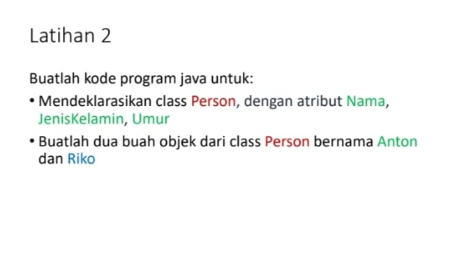
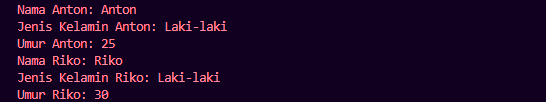

# Tugas Praktikum 2 (Pertemuan ke 3) 

|Nama|NIM|Kelas|Mata Kuliah|
|----|---|-----|------|
|**Romi Rahman**|**312310581**|**TI.23.A6**|**Pemrograman Orientasi Objek**|


# • Apa yang harus didefinisikan sebelum membuat objek?
```
Sebelum membuat objek, kita perlu mendefinisikan class. Class adalah blueprint atau template untuk membuat objek. Class mendefinisikan atribut (data) dan method (perilaku) yang akan dimiliki oleh objek.

Analogi: Bayangkan ingin membuat kue. Sebelum membuat kue (objek), kita butuh resep (class). Resep ini mendefinisikan bahan-bahan (atribut) dan langkah-langkah pembuatan (method).
```

#  • Buatlah gambar diagram class dan dua buah objek dari class Person bernama Antor dan Riko


## Penjelasan :
### Class person :
```
- Memiliki atribut nama (bertipe data string) dan umur (bertipe data integer).
- Memiliki method sapa() yang tidak menerima parameter (void) dan mungkin digunakan untuk menampilkan salam.
```
### Objek antor :
```
- Sebuah instance dari class Person dengan nilai atribut nama = "Antor" dan umur = 25.
```
### Objek riko :
```
- Sebuah instance dari class Person dengan nilai atribut nama = "Riko" dan umur = 30.
```

#  • Buatlah gambar diagram objek AkunBank dengan instance method simpanUang,ambilUang dan cekSaldo


## Penjelasan :
### Class AkunBank :
```
- Memiliki atribut noRekening (bertipe data string) dan saldo (bertipe data double).
```
```
- Memiliki method simpanUang(jumlah: double) untuk menambahkan saldo.
```
```
- Memiliki method ambilUang(jumlah: double) untuk mengurangi saldo.
```
```
- Memiliki method cekSaldo() untuk menampilkan saldo saat ini.
```

### Objek objekAkunBank :
```
Sebuah instance dari class AkunBank dengan nilai atribut noRekening = "1234567890" dan saldo = 1000000.
```



# Buatlah kode program java untuk :

# • Mendeklarasikan class Person, dengan atribut Nama, JenisKelamin, Umur

# Input Code :
## • Deklarasi kelas Person
```java
public class Person {
    private String nama;
    private int umur;
```
### Penjelasan :
```
- public class Person: Menyatakan deklarasi kelas Person yang bersifat publik, artinya bisa diakses dari mana saja.
- private String nama;, private String jenisKelamin;, dan private int umur;: Mendeklarasikan tiga variabel instance (nama, jenisKelamin, umur) yang bersifat privat. Karena variabel ini privat, mereka hanya bisa diakses melalui metode getter dan setter dalam kelas Person.
```

## • Constructor Kelas Person
```java
 public Person(String nama, String jenisKelamin, int umur) {
        this.nama = nama;
        this.jenisKelamin = jenisKelamin;
        this.umur = umur;
    }
```
### Penjelasan :
```
- public Person(String nama, String jenisKelamin, int umur): Ini adalah constructor kelas Person. Constructor digunakan untuk menginisialisasi nilai nama, jenisKelamin, dan umur ketika objek 'Person' dibuat.
- this.nama = nama;, this.jenisKelamin = jenisKelamin, dan this.umur = umur;: this digunakan untuk membedakan antara variabel instance (yang ada dalam kelas) dan parameter yang diberikan pada constructor. Kode ini mengisi variabel instance dengan nilai yang diberikan saat objek dibuat.
```

## • Getter dan Setter
### Getter dan Setter untuk nama :
```java
public String getNama() {
        return nama;
    }

    public void setNama(String nama) {
        this.nama = nama;
    }
```
### Penjelasan :
```
- getNama(): Mengembalikan nilai nama.
- setNama(String nama): Mengubah nilai nama dari objek Person.
```

### Getter dan Setter untuk JenisKelamin :
```java
public String getJenisKelamin() {
        return jenisKelamin;
    }

    public void setJenisKelamin(String jenisKelamin) {
        this.jenisKelamin = jenisKelamin;
    }
```
### Penjelasan :
```
- getJenisKelamin(): Mengembalikan nilai jenisKelamin.
- setJenisKelamin(String jenisKelamin): Mengubah nilai jenisKelamin dari objek Person.
 
```

### Getter dan Setter untuk umur :
```java
public int getUmur() {
        return umur;
    }

    public void setUmur(int umur) {
        this.umur = umur;
    }
```
### Penjelasan :
```
- getUmur(): Mengembalikan nilai umur.
- setUmur(int umur): Mengubah nilai umur dari objek Person.
```

##  • Method main
```java
public static void main(String[] args) {
        Person Anton = new Person("Anton", "Laki-laki", 25);
        Person Riko = new Person("Riko", "Laki-laki", 30);
```
### Penjelasan :
```
- 'public static void main(String[] args)': Ini adalah method utama yang menjadi titik awal eksekusi program. Pada method ini, objek 'Anton' dan 'Riko' dari kelas 'Person' dibuat.
- 'Person Anton = new Person("Anton", "Laki-laki", 25);': Membuat objek 'Anton' dari kelas 'Person', dengan nilai 'nama' = '"Anton"', 'jenisKelamin' = '"Laki-laki"', dan 'umur' = '25''.
- 'Person Riko = new Person("Riko", "Laki-laki", 30);': Membuat objek 'Riko' dari kelas 'Person', dengan nilai 'nama' = '"Riko"', 'jenisKelamin' = '"Laki-laki"', dan 'umur' = '30'.
```

## • Mencetak informasi ke konsol
### Menampilkan informasi Anton :
```java
        System.out.println("Nama Anton: " + Anton.getNama());
        System.out.println("Jenis Kelamin Anton: " + Anton.getJenisKelamin());
        System.out.println("Umur Anton: " + Anton.getUmur());
```
### Menampilkan informasi Riko :
```java
        System.out.println("Nama Riko: " + Riko.getNama());
        System.out.println("Jenis Kelamin Riko: " + Riko.getJenisKelamin());
        System.out.println("Umur Riko: " + Riko.getUmur());
    }
}
```
### Penjelasan :
```
- System.out.println("Nama Anton: " + Anton.getNama());: Mengambil nilai nama dari objek Anton dengan menggunakan metode getter getNama() dan mencetaknya ke konsol.
- System.out.println("Jenis Kelamin Anton: " + Anton.getJenisKelamin());: Mengambil nilai jenisKelamin dari objek Anton dengan metode getJenisKelamin().
- System.out.println("Umur Anton: " + Anton.getUmur());: Mengambil nilai umur dari objek Anton dengan metode getUmur().
```

# Output :


# • Buatlah dua buah objek dari class Person bernama Anton dan Riko

### Penjelasan :
```
Anton dan Riko adalah dua objek yang dibuat dari class Person.

- Anton memiliki nilai "Anton", "Laki-laki", dan 25 untuk atribut nama, jenisKelamin, dan umur.
- Riko memiliki nilai "Riko", "Laki-laki", dan 30 untuk atribut nama, jenisKelamin, dan umur.
```


# Buatlah kode java untuk :
# • Mendeklaraskian classAkunBank dan tetapkan nilai saldo awal dengan intance method simpanUang, ambilUang dan cekSaldo
## • Deklarasi kelas
```java
public class AkunBank {
    private int saldo;
```
### Penjelasan :
```
- public class AkunBank: Ini mendefinisikan sebuah kelas bernama AkunBank. Kelas ini bersifat publik, yang berarti bisa diakses dari bagian mana pun dari program.
- private int saldo: Mendeklarasikan variabel saldo yang bersifat private, berarti hanya bisa diakses dari dalam kelas AkunBank. Variabel ini menyimpan jumlah uang yang ada di akun bank.
```
## • Constructor
```java
public AkunBank(int saldoAwal) {
        this.saldo = saldoAwal;
    }
```
### Penjelasan :
```
- public AkunBank(int saldoAwal): Ini adalah constructor, yaitu metode khusus yang akan dipanggil ketika objek dari kelas ini dibuat. Constructor menerima parameter saldoAwal, yang digunakan untuk menginisialisasi saldo awal akun.
- this.saldo = saldoAwal: this digunakan untuk merujuk ke variabel instance saldo dari objek yang sedang dibuat, dan mengisinya dengan nilai saldoAwal.
```

## Method simpanUang
```java
public void simpanUang(int jumlah) {
        saldo += jumlah;
        System.out.println("Simpan uang: Rp. " + jumlah);
        System.out.println("Saldo saat ini: Rp. " + saldo);
    }
```
### Penjelasan :
```
- public void simpanUang(int jumlah): Ini adalah method untuk menambah uang ke akun. Metode ini tidak mengembalikan nilai (menggunakan void), dan menerima parameter jumlah, yaitu jumlah uang yang ingin disimpan.
- saldo += jumlah: Menambahkan jumlah ke variabel saldo, berarti saldo bertambah sesuai dengan uang yang disimpan.
- System.out.println(...): Mencetak informasi ke konsol, yaitu j`umlah uang yang disimpan dan saldo saat ini setelah penyimpanan.
```

## Method ambilUang
```java
public void ambilUang(int jumlah) {
        if (jumlah <= saldo) {
            saldo -= jumlah;
            System.out.println("Ambil uang: Rp. " + jumlah);
            System.out.println("Saldo saat ini: Rp. " + saldo);
        } else {
            System.out.println("Saldo tidak mencukupi.");
        }
    }
```
### Penjelasan
```
- public void ambilUang(int jumlah): Method untuk mengambil uang dari akun. Sama seperti simpanUang, method ini tidak mengembalikan nilai dan menerima parameter jumlah, yang merepresentasikan jumlah uang yang ingin diambil.
- if (jumlah <= saldo): Mengecek apakah jumlah yang ingin diambil tidak melebihi saldo saat ini. Jika uang cukup, maka:
saldo -= jumlah: Saldo dikurangi dengan jumlah yang ingin diambil.
System.out.println(...): Menampilkan informasi tentang uang yang diambil dan saldo yang tersisa setelah pengambilan.
- Jika uang yang ingin diambil lebih besar dari saldo:
System.out.println("Saldo tidak mencukupi."): Menampilkan pesan bahwa saldo tidak cukup.
```

## Method cekSaldo
```java
public void cekSaldo() {
        System.out.println("Saldo saat ini: Rp. " + saldo);
    }
```
### Penjelasan
```
- public void cekSaldo(): Method ini digunakan untuk mengecek saldo saat ini di akun. Method ini tidak memerlukan parameter dan hanya menampilkan saldo yang ada saat ini.
```

## Method main
```java
public static void main(String[] args) {
        AkunBank akun = new AkunBank(100000);
        akun.cekSaldo();
        akun.simpanUang(50000);
        akun.ambilUang(75000);
        akun.cekSaldo();
    }
}
```
### Penjelasan
```
- public static void main(String[] args): Ini adalah method main yang merupakan titik awal eksekusi dari program Java. Setiap program Java harus memiliki method main agar bisa dijalankan.
- AkunBank akun = new AkunBank(100000): Membuat sebuah objek akun dari kelas AkunBank, dengan saldo awal sebesar 100000.
- akun.cekSaldo(): Memanggil method cekSaldo untuk menampilkan saldo awal.
- akun.simpanUang(50000): Memanggil method simpanUang untuk menambah saldo sebesar 50000.
- akun.ambilUang(75000): Memanggil method ambilUang untuk mengambil uang sebesar 75000.
- akun.cekSaldo(): Setelah transaksi di atas, method ini dipanggil lagi untuk menampilkan saldo akhir.
```

# Output :


# • Buat objek AkunBank dan tetapkan nilai saldo awal Rp. 100000, kemudian panggil 3 method tersebut dan tampilkan proses berikut :


